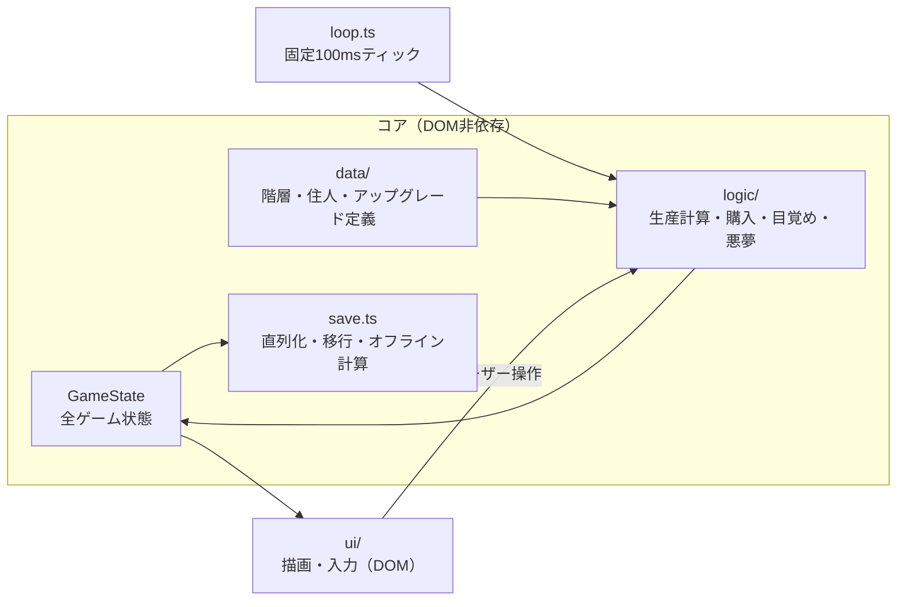
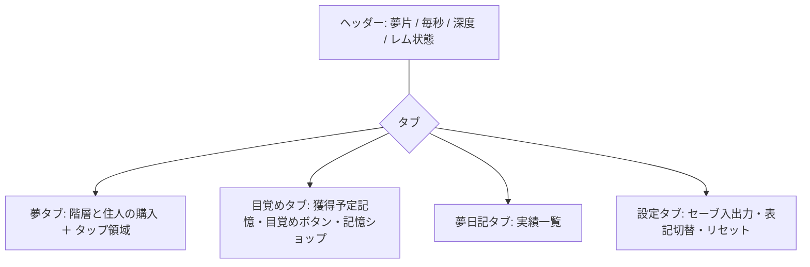

# 眠りの跡 — 夢潜行インクリメンタルゲーム 仕様書 v0.2

## 1. 概要

### 1.1 コンセプト

眠りに落ちて夢の階層を深く潜っていくインクリメンタルゲーム。
深い階層ほど夢の中の時間が加速し、生産が爆発的に増える。
「目覚める」ことがプレステージ（リセット）であり、夢から「記憶」を持ち帰って
現実側の睡眠環境を強化し、次の眠りでより深く潜れるようになる。

### 1.2 ジャンル調査と差別化

2025〜2026年のインクリメンタルゲーム市場調査の結果：

- 飽和テーマ: クッキー/菓子、鉱山採掘、宇宙開拓、農場経営（itch.io では mining 29本、space 70本超）
- 近年のヒット作（Nodebuster, Digseum, The Gnorp Apologue）の共通点は
  「テーマとメカニクスの一致」「触って気持ちいいフィードバック」「短くても濃い体験」
- 「夢・睡眠・夢の階層」を主題にした著名なインクリメンタルゲームは現状ほぼ存在しない

本作の売りは、インクリメンタルゲームの定番メカニクスすべてに夢のテーマで
物語的な意味を与えること：

| 定番メカニクス | 本作での意味づけ |
|---|---|
| プレステージ（リセット） | 目覚め。夢の中の進行は失われるが「記憶」が残る |
| リセット後の永続強化 | 記憶で現実の睡眠環境（ベッド・枕・香り）を改善する |
| 指数的な生産倍率 | 深層ほど夢内時間が加速する（時間膨張） |
| オフライン進行 | ゲームを閉じている間もあなたは「眠っている」＝夢が進む |
| 自動化の解放 | 明晰夢。夢を自分の意思で操れるようになる |
| ランダムイベント | 悪夢の出現。祓えばレア資源、放置すればデバフ |
| 周期バフ | レム睡眠サイクル。一定周期で夢が鮮明になり生産が跳ねる |
| 実績・図鑑 | 夢日記。見た夢・出会った住人・祓った悪夢が記録される |

### 1.3 想定ユーザー

- ブラウザで手軽に遊べる放置ゲーム好き（PC中心、スマホ閲覧も考慮）
- 1セッション5〜30分 × 数週間のリテンションを想定

### 1.4 成功の定義

- 初回プレイ10分以内に「目覚め＝プレステージしたい」と思わせる導線が機能する
- 1周目〜3周目でプレイ体験が質的に変化する（手動→半自動→戦略選択）
- GitHub Pages 上で誰でもURLひとつで遊べる

## 2. スコープ

### 2.1 本バージョン（v1.0）でやること

- コア生産ループ（夢片・住人・階層1〜5）
- プレステージ第1層（目覚め／記憶／記憶ショップ）
- オフライン進行
- 明晰夢（自動購入）、悪夢イベント、レムサイクル
- 夢日記（実績）
- ローカルセーブ（localStorage、エクスポート/インポート付き）
- GitHub Pages への自動デプロイ

### 2.2 やらないこと（将来バージョン）

- プレステージ第2層「深層覚醒」（v1.1 以降。設計だけ §3.8 に記す）
- 音・BGM
- クラウドセーブ / ランキング
- 多言語対応（まず日本語のみ。文言は一元管理し将来のi18nに備える）
- モバイル専用UI最適化（レスポンシブ対応まではやる）

## 3. ゲームデザイン詳細

### 3.1 資源

| 資源 | 入手 | 用途 | リセット対象 |
|---|---|---|---|
| 夢片（ゆめかけら） | 住人の生産・タップ | 住人購入・階層解放 | 目覚めで消える |
| 記憶 | 目覚め時に獲得 | 記憶ショップ | 残る |
| 悪夢の残滓 | 悪夢を祓う | 特殊アップグレード | 残る |

数値は break_eternity.js の Decimal で扱う（1e308 超に備える。到達目標は当面 1e100 程度）。

### 3.2 コア生産ループ

- タップ（クリック）で夢片 +1 ×（タップ倍率）
- 「住人」（ジェネレーター）を夢片で購入すると毎秒生産
- 住人の価格は `basePrice × 1.15^(所持数)` の等比で上昇（定番カーブ）
- ティックは固定タイムステップ 100ms、描画は requestAnimationFrame

### 3.3 階層（レイヤー）

深く潜るほど時間が加速し、生産倍率がかかる。階層は夢片を消費して解放する。

| 階層 | 名称（案） | 解放コスト | 時間加速倍率 | 住人（各4種） |
|---|---|---|---|---|
| L1 | まどろみの浜辺 | 0（初期） | ×1 | ひつじ、うたたね猫 など |
| L2 | 記憶の図書館 | 1e4 | ×8 | 司書のフクロウ など |
| L3 | 逆さの都市 | 1e7 | ×64 | 逆さ歩きの人形 など |
| L4 | 静寂の深海 | 1e11 | ×512 | 発光クラゲ など |
| L5 | 星の墓場 | 1e16 | ×4096 | 眠れる巨人 など |

- 各階層に住人4種（basePrice は階層内で 10 / 1e3 / 1e5 / 1e8 目安、生産量も段階増）
- 上位階層の住人生産には階層の時間加速倍率が乗る
- 深い階層ほど悪夢の出現率が上がる（リスクとリターン）

### 3.4 プレステージ「目覚め」

- 任意のタイミングで目覚められる（推奨ラインをUIで提示）
- 獲得記憶 = `floor( (今回の眠りで稼いだ夢片合計 / 1e6) ^ 0.5 )`
  - 初回は 1e6 夢片で記憶1。以後は深追いより回転が有利になる平方根カーブ
- 目覚めでリセット: 夢片、住人、階層解放状況
- 残るもの: 記憶、悪夢の残滓、記憶ショップ購入、夢日記

### 3.5 記憶ショップ（永続強化）

| アップグレード | 効果 | コスト曲線 |
|---|---|---|
| ふかふかの枕 | 全生産 ×(1 + 0.1×Lv) | 1, 2, 4, 8...（記憶） |
| 深い眠りの香り | 開始時に L2〜 を解放済みに | 5, 25, 125（Lv3まで） |
| 夢の栞 | タップ倍率 ×2/Lv | 3, 9, 27... |
| 明晰夢の訓練 | 住人の自動購入を階層ごとに解放 | 10, 30, 90... |
| 安眠の寝具 | オフライン進行効率 +25%/Lv（基礎50%→最大100%） | 4, 16 |
| 目覚まし時計の破壊 | レムサイクルのバフ時間 +30秒/Lv | 6, 36 |

### 3.6 イベント系

- 悪夢: 3〜8分に1回抽選で出現。60秒以内にクリック連打（または自動迎撃）で祓うと
  悪夢の残滓を獲得。放置すると 90秒間 生産 −50%
- レムサイクル: 10分周期で90秒間、生産 ×2（強化で延長可）
- オフライン進行: 復帰時に経過時間 ×効率（基礎50%）分の夢片をまとめて付与。上限12時間

### 3.7 夢日記（実績）

- 「はじめての目覚め」「L5到達」「悪夢を10回祓う」等 30〜40 個
- 各実績に少額の永続ボーナス（全生産+1%等）を付け、収集動機を作る

### 3.8 【将来】深層覚醒（第2プレステージ・v1.1）

記憶と記憶ショップごとリセットし「夢核」を得る。夢核はゲームルール自体を変える
アップグレード（新階層帯 L6〜、悪夢の味方化、レム永続化等）に使う。
v1.0 では画面・データモデルに拡張余地だけ確保する。

## 4. 非機能要件

- 60fps を目標（描画更新は差分のみ、毎フレーム全DOM再構築をしない）
- セーブ: 30秒ごと自動 + 操作時 + ページ離脱時。localStorage、JSON + バージョン番号付き
- セーブデータ移行: `version` フィールドとマイグレーション関数の連鎖で対応
- 依存は最小限（break_eternity.js のみ想定）。バンドルサイズ < 200KB gzip 目標
- 対応ブラウザ: 最新の Chrome / Edge / Firefox / Safari

## 5. アーキテクチャ



- コアロジックはDOM非依存の純粋関数群にし、Vitest で単体テスト可能にする
- UIフレームワークは使わず、画面ごとの描画モジュール + 差分更新ヘルパで構成

### 5.1 ファイル構成（予定）

```
src/
  main.ts            エントリ。ループ起動・UI初期化
  loop.ts            固定タイムステップのゲームループ
  state.ts           GameState 型定義と初期状態
  save.ts            セーブ/ロード/マイグレーション/オフライン計算
  data/
    layers.ts        階層定義（名称・コスト・倍率）
    dwellers.ts      住人定義
    upgrades.ts      記憶ショップ・残滓アップグレード定義
    achievements.ts  夢日記定義
  logic/
    production.ts    毎秒生産量の計算
    purchase.ts      購入可否・価格計算
    prestige.ts      記憶量計算・目覚め処理
    events.ts        悪夢・レムサイクル
  ui/
    index.ts         画面組み立て・タブ切替
    format.ts        大数フォーマット（1.23e45 / 兆京表記）
    （タブごとのモジュール）
tests/               コアロジックの Vitest テスト
index.html
```

## 6. 技術スタック

| 項目 | 採用 | 理由 | 代替案 |
|---|---|---|---|
| 言語 | TypeScript | 型でゲームデータ定義のミスを防ぐ | — |
| ビルド | Vite | 高速・GitHub Pages 向け静的出力が容易 | webpack（重い） |
| UI | Vanilla TS + CSS | 本作のUI規模なら十分・依存最小 | React（タブ数増なら再検討） |
| 大数 | break_eternity.js | 1e308 超対応のデファクト | 素のnumber（上限で破綻） |
| テスト | Vitest | Vite と統合が自然 | Jest |
| CI/CD | GitHub Actions → Pages | push で自動デプロイ | 手動 gh-pages |

## 7. データモデル（セーブデータ）

```ts
interface SaveData {
  version: number;
  lastSavedAt: number;          // オフライン計算用エポックms
  fragments: string;            // Decimal を文字列で直列化
  totalFragmentsThisSleep: string;
  memories: string;
  nightmareResidue: number;
  unlockedLayers: number;       // 解放済み最深階層
  dwellers: Record<string, number>;      // 住人ID → 所持数
  memoryUpgrades: Record<string, number>; // アップグレードID → Lv
  achievements: string[];
  stats: { totalAwakenings: number; totalNightmaresBanished: number; /* … */ };
  eventState: { remCycleStart: number; activeNightmare?: { expiresAt: number } };
}
```

## 8. 画面・UI

1画面 + タブ構成。ヘッダーに夢片残高・毎秒生産・現在深度・レムサイクル表示を常設。



- 悪夢出現時は画面端にオーバーレイ表示（タブを問わず対応可能に）
- 配色は夜空〜深海のダークトーン基調。深い階層ほど背景色が深くなる演出

## 9. エラーハンドリング

- セーブ破損: パース失敗時はバックアップスロット（1世代前）から復元、両方不可なら新規開始（破損データはエクスポート提示）
- localStorage 不可（プライベートモード等）: メモリ内のみで動作し、警告バナー表示
- オフライン時間が負（端末時計巻き戻し）: 0 として扱う
- ループ停止検知（タブ非アクティブ）: 復帰時に経過分をオフライン進行と同ルールで補填

## 10. 実装フェーズ計画

| Phase | 内容 | ゴール |
|---|---|---|
| 0 | Vite+TS 雛形、ゲームループ、セーブ/ロード、Pages デプロイCI | 空画面がURLで公開される |
| 1 | 夢片・住人・階層1〜5・購入UI・大数表記 | 生産ループが遊べる |
| 2 | 目覚め・記憶ショップ・オフライン進行 | 周回が成立する |
| 3 | 明晰夢・悪夢・レムサイクル・夢日記 | 「ずっと遊べる」変化が入る |
| 4 | バランス調整・演出強化（階層別背景等）・テスト拡充 | v1.0 リリース |

各 Phase 完了ごとにコミット・プッシュし、動作確認を挟む。

## 11. 未確定事項

| 項目 | 状況 |
|---|---|
| タイトル | 「眠りの跡」で確定（2026-09-05） |
| 大数の表記 | 既定は日本語単位（兆・京…）で実装、設定タブで科学表記に切替可（v0.1実装で確定） |
| バランス数値 | §3 の数値は初期案。Phase 2 で実プレイ計測して調整する |
| 悪夢の操作感 | 連打で祓う案。単純すぎる場合はミニパズル化を検討 |

## 変更履歴

- v0.1 (2026-09-05) 初版
- v0.2 (2026-09-05) タイトルを「眠りの跡」に確定
